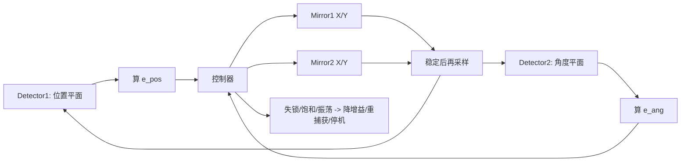

# 官网技术架构

这页官方资料讲的是一种“主动光束稳定”闭环系统：用探测器实时测出激光束当前位置，再驱动转向镜去抵消振动、热漂移和冲击带来的偏移，把光束锁回目标位置。页面明确写到探测器可用 `4-QD` 或 `PSD`，并且只需要高反镜后的一小部分透射光就能工作。([surisetech.com](https://www.surisetech.com/mrc-systems-active-laser-beam-stabilization/))

我把它拆成 5 个层次：

1. 传感  
   探测器测到“实际光束位置”，和预设中心位置比较。中心点就是你想固定住的光束位置。([surisetech.com](https://www.surisetech.com/mrc-systems-active-laser-beam-stabilization/))

2. 控制  
   闭环控制器持续算偏差，再控制快速转向镜修正光路。页面还强调它是“有源闭环控制”，而且尽量用模拟内核来减少相移。([surisetech.com](https://www.surisetech.com/mrc-systems-active-laser-beam-stabilization/))

3. 执行  
   执行器主要是压电驱动反射镜，安装位置可以直接替换现有反射镜。([surisetech.com](https://www.surisetech.com/mrc-systems-active-laser-beam-stabilization/))

4. 架构差异  
   双轴系统只有 1 个探测器 + 1 个转向镜，能把光束“定位”，但方向还可能漂；四轴系统有 2 个探测器 + 2 个转向镜，能同时锁住位置和方向。([surisetech.com](https://www.surisetech.com/mrc-systems-active-laser-beam-stabilization/))

5. 现场集成  
   探测器通常放在高反镜后面；如果光束太大，也可加分光片/透镜。系统要装在稳定平台上。软件/接口可走 USB，也支持以太网或 RS-232，并显示位置、强度和压电电压。([surisetech.com](https://www.surisetech.com/mrc-systems-active-laser-beam-stabilization/))

一句话总结：  
它本质上是“光斑位置误差 -> 控制器 -> 快速转镜补偿 -> 再测量”的实时闭环系统；双轴管位置，四轴管位置加方向。([surisetech.com](https://www.surisetech.com/mrc-systems-active-laser-beam-stabilization/))

官方页链接： [MRC主动激光束稳定系统](https://www.surisetech.com/mrc-systems-active-laser-beam-stabilization/)


# 本项目初步架构

可以。把 MRC 的思路搬到显微镜里，核心不是“把图像调正”，而是做一个“测偏差 -> 推镜面/平台 -> 再测 -> 继续修正”的闭环。官方资料的标准做法是两级结构：第一级管“位置”，第二级管“方向/角度”；探测器尽量放在第二个反射镜后面，第二个探测器尽量靠近目标端，必要时用透镜或分光片取样。([MRC 标准布局 PDF](https://www.mrc-systems.de/downloads/en/laser-beam-stabilization/Description_MRC_Standard-Setup_v1_en.pdf), [快速安装指南](https://www.mrc-systems.de/downloads/en/laser-beam-stabilization/Quick-Installation-Guide_en_vers2.pdf))

**你在显微镜里要这样理解和操作**

1. **先定义“目标”**
   你要锁住的不是“光斑看起来居中”，而是“某个固定平面上的光斑位置和方向都稳定”。  
   如果只是让相机上的光斑居中，属于单平面位置控制；如果还要让离焦、偏摆、热漂导致的漂移都压住，就要做两级控制。

2. **搭硬件**
   - 第一块可调镜放在光路前段，尽量靠近光源端。  
   - 第二块可调镜放在更靠近目标端的位置。  
   - Detector 1 放在第二块镜后面，吃一点泄漏光就行。  
   - Detector 2 放在更靠近目标的位置。  
   - 光束大时，探测器前加透镜或分光片。  
   官方建议镜-探测器距离尽量有 0.5 m 左右，短了就用透镜补敏感度。([标准布局 PDF](https://www.mrc-systems.de/downloads/en/laser-beam-stabilization/Description_MRC_Standard-Setup_v1_en.pdf), [安装指南](https://www.mrc-systems.de/downloads/en/laser-beam-stabilization/Quick-Installation-Guide_en_vers2.pdf))

3. **先做开环预对准**
   不要先开闭环。  
   先把激光打到两个探测器中心，控制器上信号尽量接近 0 偏差。官方说这一步要在控制段关闭时做，目的是把压电镜归零。([快速安装指南](https://www.mrc-systems.de/downloads/en/laser-beam-stabilization/Quick-Installation-Guide_en_vers2.pdf))

4. **再开第一级**
   先只启用 stage 1。  
   如果一开就“冲到红色范围”，说明方向编码错了，或者 x/y 方向接反了。把对应方向开关或软件符号反过来。([快速安装指南](https://www.mrc-systems.de/downloads/en/laser-beam-stabilization/Quick-Installation-Guide_en_vers2.pdf))

5. **调增益**
   先把 P 值调到“刚好不振荡”的位置。  
   官方建议先逐步加大到出现振荡，再回退一点。两个 stage 分开调。必要时切低带宽档。([快速安装指南](https://www.mrc-systems.de/downloads/en/laser-beam-stabilization/Quick-Installation-Guide_en_vers2.pdf))

6. **再开第二级**
   第一级稳定后，再开第二级。  
   这时第二级负责更远端的方向修正，最终让目标端光斑不漂。官方文档明确说 4 轴系统就是两个独立控制级，能同时稳位置和角度。([快速安装指南](https://www.mrc-systems.de/downloads/en/laser-beam-stabilization/Quick-Installation-Guide_en_vers2.pdf), [位置/角度精度 PDF](https://www.mrc-systems.de/downloads/en/laser-beam-stabilization/Description_MRC_Position-and-angle-accuracy_vers2.pdf))

**放到你这个项目里，最实用的落地方式是：**

- 只有一个显微镜画面/一个目标平面时，先用你仓库里的 `z_scan_legacy`。  
  这就是“单平面校直”，更像“把光斑拉回中心并保持住”。`README.md` 里已经给了对应跑法。([README.md](E:\jupyter file\2_Optics\8821L\README.md:355))

- 如果你真的能做出“两个观测平面”或“两路探测器”，再上 `dual_detector_4axis`。  
  这才是最接近 MRC 官方逻辑的方式：一组管位置，一组管角度。([README.md](E:\jupyter file\2_Optics\8821L\README.md:351), [系统简介.md](E:\jupyter file\2_Optics\8821L\系统简介.md:360))

**建议你按这个顺序试：**
```powershell
python SpotZoom.py --check-env
python SpotZoom.py --alignment-strategy z_scan_legacy --xy-driver dryrun --z-driver dryrun --detector-backend classic --frame-source-image artifacts/spotzoom_qt_sample.png --skip-roi --no-preview --disable-startup-motion-check --disable-run-lock
```

如果你要模拟 MRC 的 4 轴思路，再试：
```powershell
python SpotZoom.py --alignment-strategy dual_detector_4axis --detector-mode dual_detector --frame-source-image touview.png --frame-source-image-2 detector.png --xy-driver dryrun --z-driver dryrun --detector-backend classic --skip-roi --no-preview --disable-startup-motion-check --disable-run-lock
```

**判断是否做对了**
- 探测器信号不饱和。  
- 中心偏差接近 0。  
- 开闭环后没有明显来回振荡。  
- 抖动来了以后，系统能自己拉回去。  
- 如果一开就飘，先查方向编码，再查 P 值，再查机械稳定性。

**一句话总结**
你不是在“手工对中光斑”，而是在搭一个两级闭环：前级锁位置，后级锁方向。显微镜场景里，单相机先用单平面闭环，能做双探测器就按 MRC 的双级架构做。


可以，这套逻辑我建议按“**两级观测 + 两级执行 + 统一耦合解耦**”来做。这个判断是基于官方 MRC 主动光束稳定页的两级闭环思路，再结合你仓库里已经预留的 `dual_detector_4axis` 架构推出来的，不是官方逐字原文。参考：[官方页面](https://www.surisetech.com/mrc-systems-active-laser-beam-stabilization/)、[README 里的 4 轴方案](E:\jupyter file\2_Optics\8821L\README.md:351)、[系统简介](E:\jupyter file\2_Optics\8821L\系统简介.md:360)、[SpotZoom 参数入口](E:\jupyter file\2_Optics\8821L\SpotZoom.py:23167)、[UI 编排层](E:\jupyter file\2_Optics\8821L\spotzoom_qt_ui\services.py:1)。



**实现逻辑**
1. **硬件分工**
   - `Detector1` 负责“位置误差”
   - `Detector2` 负责“角度误差”
   - `Mirror1 X/Y` 主要吃 `e_pos`
   - `Mirror2 X/Y` 主要吃 `e_ang`
   - 4 个轴不是各干各的，而是通过标定矩阵解耦后协同工作

2. **控制律**
   - `e_pos = [dx1, dy1]`
   - `e_ang = [dx2, dy2]`
   - `u1 = Kp1*e_pos + Ki1*∫e_pos + C12*e_ang`
   - `u2 = Kp2*e_ang + Ki2*∫e_ang + C21*e_pos`
   - 初期先把 `C12/C21 = 0`，只跑主通道，稳定后再补耦合项

3. **启动流程**
   - 先机械粗对准，让两个探测器都能看到光斑
   - 记录两路中心点作为零位
   - 小脉冲测试 4 个轴的正负方向
   - 测一次 4x4 灵敏度矩阵 `J`
   - 检查是否饱和、是否跑偏、是否存在明显串扰

4. **闭环流程**
   - 同步采集两路图像
   - 检测两个中心点和置信度
   - 计算 `e_pos / e_ang`
   - 滤波、门控、收敛判定
   - 下发镜面修正
   - 等待稳定后再采样
   - 连续 `N` 帧都满足阈值，判定收敛

5. **异常处理**
   - 检测不到光斑：走重捕获或 fallback
   - 信号饱和：降曝光/减增益/缩 ROI
   - 来回振荡：降 `Kp`，增大 settle time
   - 方向反了：翻转对应轴符号
   - 串扰明显：重新做 `J` 标定

**落到你这个项目里，直接对应的入口就是：**
- `SpotZoom.py` 里的 `--alignment-strategy dual_detector_4axis`
- `--detector-mode dual_detector`
- `--frame-source-image` / `--frame-source-image-2`
- `--stage1-kp/ki`、`--stage2-kp/ki`
- `--coupling-c12`、`--coupling-c21`
- `spotzoom_qt_ui` 已经在 UI 层把这些参数编排好了

**实际操作建议**
- 先用 `dryrun + classic` 把闭环逻辑跑通
- 再接真机
- 先只开 stage1，再开 stage2
- 最后再把耦合补偿打开

如果你要，我下一步可以直接把这套逻辑整理成一份“可实施的系统方案”，包括：
- 光路布局图
- 控制状态机
- 参数表
- 以及对应到你仓库里的文件改动点
- 